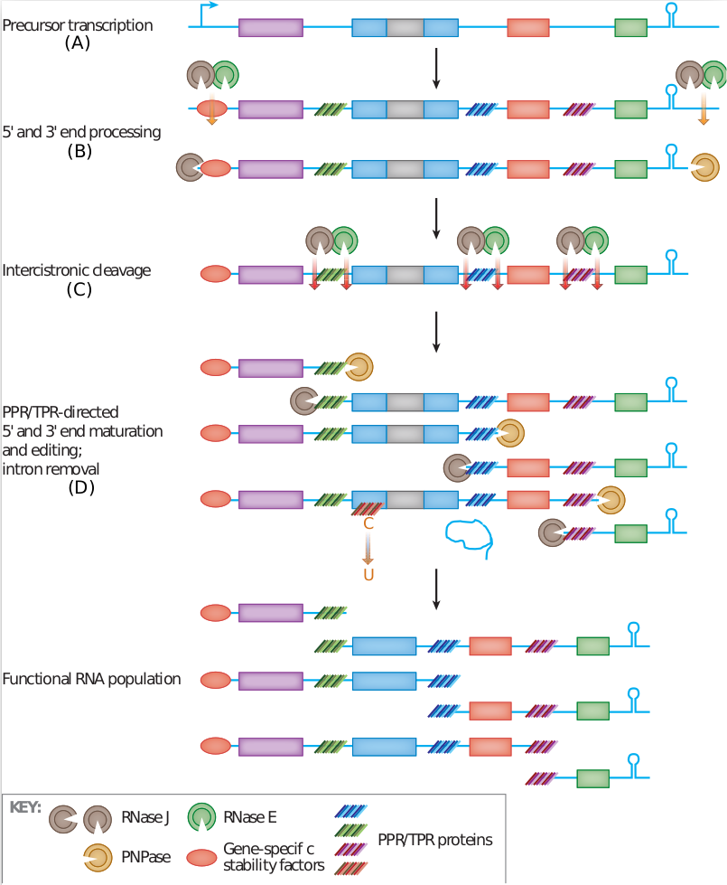

```{r, include=FALSE}
knitr::opts_chunk$set(echo = TRUE, fig.align = "center")
```


```{r, echo=FALSE, out.width="50%", fig.align="center"}
knitr::include_graphics("../img/whos_that_Rnase.png")
```

## Biological context

### The chloroplast

The chloroplast is a plant-cell organelle derived from endosymbiosis that
carries out photosynthesis and therefore plays a central role in energy production
and carbon fixation. Its genome (~154 kb in *Arabidopsis thaliana*, encoding ~130
genes) produces long primary transcripts that undergo extensive post-transcriptional
maturation before becoming functional: nucleolytic cleavage shapes transcript
boundaries, introns are spliced, and specific bases are edited 
(**Figure 1**).

```{r, echo=FALSE, out.width="60%", fig.align="center", fig.cap="**Figure 1.** Chloroplast RNA maturation. Long precursor transcripts produced from gene clusters are cleaved and processed by ribonucleases (RNase J, PNPase, RNase E). RNA-binding proteins and RNA secondary structures protect mature regions. Figure adapted from [Stern, Goldschmidt-Clermont & Hanson (2010)](https://doi.org/10.1146/annurev-arplant-042809-112242)."}

```

### Your mission

You are a computational biologist collaborating with molecular biologists
studying gene expression in the *Arabidopsis thaliana* chloroplast. Your
colleagues have generated loss-of-function mutants for three uncharacterized
chloroplast ribonucleases (RNases) and sequenced their transcriptomes, with three
biological replicates for each mutant and three wild-type replicates.

**Your mission** is to analyse the RNA-seq coverage profiles to characterize 
the effect of loss-of-function mutants on chloroplast transcripts, and from this 
to infer the molecular function of the corresponding RNase. To do so you will 
combine **segmentation** and **differential expression** analyses.

---

## Setup

The three datasets correspond to three different RNase mutants. Choose one for now
(`DATASET_ID = 1`, `2`, or `3`).

```{r}
options(warn = -1) #options(warn = 0)
DATASET_ID <- 3
```

```{r, message=FALSE}
library(rtracklayer)
library(fpopw)
library(DESeq2)
source("utils.R")
```

---

## Loading the data

### Chloroplast gene annotations

We import the annotation of the chloroplast genome as a `GRanges` object, the
standard Bioconductor container for genomic sorted intervals.

```{r}
Pt_ath <- import("../annotations/Pt_ath.gff")
Pt_ath
```

Each row is one annotated gene. The key accessors are:

| Accessor | Returns |
|---|---|
| `seqnames(Pt_ath)` | chromosome name |
| `strand(Pt_ath)` | strand (`+` or `-`) |
| `start(Pt_ath)` | leftmost genomic coordinate |
| `end(Pt_ath)` | rightmost genomic coordinate |
| `width(Pt_ath)` | gene length in bp |
| `length(Pt_ath)` | number of genes |

::: {.question}
How many genes are annotated on the chloroplast genome?
How many on each strand?
:::

```{r}
length(Pt_ath)
table(strand(Pt_ath))
```

::: {.question}
For a gene on the + strand, which coordinate (`start` or
`end`) corresponds to the 5' end? What about a gene on the − strand?
:::

```{r}
plus_genes <- Pt_ath[strand(Pt_ath) == "+"]
head(start(plus_genes))  # 5' end
head(end(plus_genes))    # 3' end
```

```{r}
minus_genes <- Pt_ath[strand(Pt_ath) == "-"]
head(end(minus_genes))   # 5' end
head(start(minus_genes)) # 3' end
```

### Sample metadata

```{r}
sample_info <- read.table(
  paste0("../metadata/dataset_", DATASET_ID, ".tsv"),
  header = TRUE
)
sample_info
```

`sample_info` has one row per sample and five columns:

- **sample** : unique sample identifier (`wt_1` … `wt_3`, `mut_1` … `mut_3`)
- **condition** : experimental group (`wt` or `mut`)
- **replicate** : biological replicate index (1, 2, or 3)
- **forward** : path to the BigWig file for the forward (+ strand) coverage
- **reverse** : path to the BigWig file for the reverse (− strand) coverage

### Coverage matrices

We load the BigWig files and expand them into position-by-sample matrices, one
matrix per strand.

BigWig stores coverage in run-length encoded (RLE) form: consecutive positions
with the same count are grouped into intervals. `import()` returns a `GRanges`
with a `score` column (the count value) and a `width` equal to the number of
positions with that value. `rep(cov_gr$score, width(cov_gr))` expands this back
to one value per genomic position.

```{r, message=FALSE}
strands  <- c("forward", "reverse")
cov_list <- lapply(strands, function(strand) {
  cov_mat <- do.call(cbind, lapply(sample_info[, strand], function(bio_rep_path) {
    cov_gr <- import(paste0("../", bio_rep_path))
    rep(cov_gr$score, width(cov_gr))
  }))
  colnames(cov_mat) <- sample_info$sample
  cov_mat
})
names(cov_list) <- strands
```

`cov_list$forward` and `cov_list$reverse` are each an integer matrix of
dimensions `[154478 × 6]`: one row per genomic position, one column per sample.

```{r}
colnames(cov_list$forward)
dim(cov_list$forward)
```

---

## What signal should we segment?

### Exploring *rbcL*

We start with a well-known gene: *rbcL* (ribulose-1,5-bisphosphate
carboxylase/oxygenase large subunit), located at positions 54 958 - 56 397 on
the + strand. We will examine a slightly wider window (54 800 – 56 500).

::: {.exercise}
Plot the log~2~-coverage of all six samples in the *rbcL* window
(add a pseudo-count = 0.5 to avoid log(0)), with wt replicates in blue and mutant
replicates in red. Add a final track showing the arithmetic mean log~2~-coverage 
across all six replicates.
:::

```{r, fig.height=12, fig.width=9}
pseudo       <- 0.5
window_start <- 54800
window_stop  <- 56500
pos          <- window_start:window_stop           
cov_rbcL     <- cov_list$forward[pos, ]
log2_cov     <- log2(cov_rbcL + pseudo)
mean_log2    <- rowMeans(log2_cov)

## PLOT 
ylim_all     <- c(0, max(log2_cov) + 0.5)
par(mfrow = c(7, 1), mar = c(2, 4, 1.5, 1))
for (s in colnames(log2_cov)) {
  col <- ifelse(grepl("^wt", s), "steelblue", "tomato")
  plot(pos, log2_cov[, s], type = "l", col = col, lwd = 0.7,
       xlab = "", ylab = "log2-cov", main = s, ylim = ylim_all)
}
plot(pos, mean_log2, type = "l", col = "black", lwd = 0.7,
     xlab = "Genomic position", ylab = "log2-cov", main = "mean (all replicates)",
     ylim = ylim_all)
```


::: {.question}
What do you observe?
:::

We can see substantial local variation from one position to another, including 
within the gene body itself. Whether these variations are biological or not remains
unclear, but most of them are reproducible across replicates and conditions. We 
also see that, although the signal initially appears complex, it can in fact be 
summarized fairly simply: a region corresponding to the annotated gene body, 
which appears stable across conditions, followed (or surrounded) by drop in coverage 
in the wild type.

### log~2~-fold-change for *rbcL*

Instead of looking at 6 individual traces we can summarize the difference between
conditions as a log~2~-fold-change (log~2~-FC): the difference of arithmetic
means of the log~2~-coverages in the mutant versus the wild type.

$$\text{log}_2\text{FC}_i =
  \frac{1}{3}\sum_{r=1}^3\log_2(x_{i,mut,r}+0.5) -
  \frac{1}{3}\sum_{r=1}^3\log_2(x_{i,wt,r}+0.5)$$

::: {.exercise}
Compute and plot the log~2~-FC for *rbcL*.
:::

```{r, fig.height=4, fig.width=9}
wt_cols     <- sample_info$condition == "wt"
mut_cols    <- !wt_cols
log2FC_rbcL <- rowMeans(log2(cov_rbcL[, mut_cols] + pseudo)) -
               rowMeans(log2(cov_rbcL[, wt_cols]  + pseudo))

## PLOT 
plot(pos, log2FC_rbcL, type = "l", lwd = 0.7, col = "black",
     xlab = "Genomic position", ylab = expression(log[2]-FC~(mut~vs~wt)),
     main = "rbcL")
abline(h = 0, lty = 2, col = "black")
```


::: {.question}
What do you observe?
:::

The log~2~-FC scales with differences. Inside the gene body, it dampens local but 
reproducible variation between conditions and therefore remains close to zero. 
The signal shifts sharply at one or both gene boundaries, marking regions where 
reads accumulate specifically in the mutant. 

::: {.question}
What should we segment?
:::

The log~2~-FC, rather than any signal that directly depends on coverage.

### Genome-wide log~2~-FC

::: {.exercise}
Compute the same log~2~-FC signal for every position on the Pt
genome, for both strands. Store the result in `lfc_list`, this will be the
input to the segmentation method in the next section.
:::

```{r}
lfc_list <- lapply(cov_list, function(cov_mat) {
  rowMeans(log2(cov_mat[, mut_cols] + pseudo)) -
  rowMeans(log2(cov_mat[, wt_cols]  + pseudo))
})
names(lfc_list) <- names(cov_list)

str(lfc_list)
```

`lfc_list$forward` and `lfc_list$reverse` are numeric vectors of length 154 478,
one log~2~-FC value per genomic position on each strand.

## What method should we use ?

### The log~2~-FC as a piecewise-constant model with Gaussian noise

We model the log~2~-FC signal $(Y_1, \ldots, Y_n)$ as piecewise-constant with
$D$ changepoints $\tau_1 < \cdots < \tau_D$ ($\tau_0 = 0$, $\tau_{D+1} = n$).
Within each segment $\{\tau_{j-1}+1, \ldots, \tau_j\}$ the observations are
assumed i.i.d. Gaussian with segment mean $\mu_j$ and common variance $\sigma^2$:

$$Y_i \sim \mathcal{N}(\mu_j,\, \sigma^2), \quad i \in \{\tau_{j-1}+1,\ldots,\tau_j\}.$$

The changepoints are estimated by penalized maximum likelihood, equivalently FPOP minimizes

$$\sum_{j=1}^{D+1} \sum_{i=\tau_{j-1}+1}^{\tau_j} (Y_i - \mu_j)^2
  \;+\; \lambda\,\hat\sigma^2\log(n).$$

$\lambda$ is a hyperparameter (default $\lambda \sim 2$, following [Yao 1989](https://www.jstor.org/stable/25050759)) and
$\hat\sigma$ must be estimated from the data. Three common estimators are:

```{r, eval=FALSE}
est_sd <- sd(diff(x)) / sqrt(2)   # difference-based (robust to changepoints)
est_sd <- sdDiff(x, “HALL”)       # Hall et al. 1990, even more statistically grounded
est_sd <- sd(x)                   # classical sample SD, works best when the signal contains many zeros 
```

In practice, because the log~2~-FC is zero over large intergenic stretches, the
classical `sd()` outperforms the difference-based estimators and is used in
`FpopWrapper`.

### Segmentation with FPOP

::: {.exercise}
Write a wrapper `FpopWrapper(x, alpha)` around `Fpop()` that
compute the penalty $\lambda = \alpha \cdot \hat\sigma^2 \cdot \log(n)$, then
segment the two strands with $\alpha = 2$.
:::

```{r}
FpopWrapper <- function(lfc, sdFUN=sd, alpha=2) {
  est_sd <- sd(lfc)
  n      <- length(lfc)
  Fpop(lfc, lambda=alpha*est_sd^2*log(n))
}
```

```{r}
seg_list <- lapply(lfc_list, FpopWrapper, alpha=10)
names(seg_list) <- names(lfc_list)
```

::: {.note}
`Fpop_w()` supports weights and can speed up segmentation by collapsing runs of
identical values into a single weighted observation.
:::


### Visual inspection of the segmentation on *rbcL*

::: {.exercise}
Plot the log~2~-FC in the *rbcL* window, overlay the
estimated per-segment mean in red, and mark the changepoints with vertical lines.
:::

```{r}
plot(lfc_list$forward, pch=".", col="blue", xlim=c(window_start, window_stop))
lines(getSMT(seg_list$forward), col="red")
abline(v=seg_list$forward$t.est, col="black")
```

### Genome-wide inspection : elbow heuristic

The residual sum of squares (RSS) decreases monotonically with the number of changepoints $D$
(more segments always reduce the residual). The decrease is steep while genuine
signal boundaries are being recovered, then flattens once spurious changepoints
are added: each extra split can only capture noise, contributing an improvement
of order $\sigma^2$. This transition produces a visible elbow in the
RSS-vs-$D$ curve. Several methods formalize this idea to select the penalty
adaptively ([Lavielle 2005](https://inria.hal.science/inria-00070662v1); 
[Lebarbier 2005](https://doi.org/10.1016/j.sigpro.2004.11.012); 
[Arlot 2019](http://arxiv.org/abs/1901.07277)).

::: {.exercise}
Run `FpopWrapper` over a grid of $\alpha$ values on the
forward-strand log~2~-FC and plot the RSS as a function of the number of
changepoints $D$. Mark the value of $D$ obtained with $\alpha = 2$.
:::

```{r}
alphas <- 2^seq(-2, 10, by = 0.25)
res    <- lapply(alphas, function(alpha) FpopWrapper(lfc_list$forward, alpha = alpha))
```

::: {.note}
The penalty grid search can be accelerated using the CROPS algorithm
([Haynes et al. 2017](https://link.springer.com/article/10.1007/s11222-016-9687-5)),
which finds all optimal segmentations over a penalty interval.
:::

```{r}
D_est     <- sapply(res, FUN = function(x) length(x$t.est) - 1)
loss_est  <- sapply(res, FUN = function(x) x$J.est)

D_alpha   <- length(seg_list$forward$t.est) - 1

D_unique  <- sort(unique(D_est))
rss_by_D  <- tapply(loss_est, D_est, min) # Pour chaque valeur distincte de D_est, 
                                          # calculer le minimum des valeurs 
                                          # correspondantes de loss_est 

## PLOT
xlim_max  <- 6 * D_alpha
in_range  <- D_unique <= xlim_max
rss_range <- range(rss_by_D[in_range])
plot(D_unique, rss_by_D, type = "b", pch = 20, col = "blue",
     xlim = c(0, xlim_max), ylim = rss_range,
     xlab = "D", ylab = "RSS",
     main = "Pinpointing the “elbow” by eye")
abline(v = D_alpha, col = "black", lty = 2)
legend("topright",
       legend = paste0("D(alpha=10) = ", D_alpha),
       col = "black", lty = 2, bty = "n")
```

::: {.question}
Does the value $D$ obtained with $\alpha = 2$ fall near the 
elbow? Try increasing $\alpha$ (e.g. $\alpha = 10$) and observe how the 
segmentation changes.
:::

::: {.question}
How many segments does the segmentation produce on the forward
and reverse strands? Does this seem reasonable given the number of annotated
genes?
:::

## Re-annotating the genome with FPOP segments

Segmentation has given us a data-driven partition of the genome: instead of
relying on the original gene annotation, we now have regions that directly
reflect where the log~2~-FC signal changes. The next step is to rigorously test, 
for each segment, whether the coverage difference between mutant and wild type 
is statistically significant. This is exactly the question addressed by 
differential expression analysis: we simply replace genes with segments as 
the unit of analysis, and the standard DESeq2 pipeline applies without modification.

To integrate with Bioconductor we first convert the FPOP output to `GRanges`
objects, the same container used for the chloroplast gene annotations.

::: {.exercise}
Write `segToGranges()`: given the FPOP result for one strand
and a strand label (`"forward"` or `"reverse"`), return a `GRanges` with one
range per segment. Apply it to both strands and collect the results in
`gr_list`.
:::

```{r}
segToGranges <- function(seg, strand) {
  cp         <- seg$t.est
  seg_starts <- c(1,cp[-length(cp)]+1)
  seg_ends   <- cp
  GRanges(seqnames = "Pt",
          strand   = ifelse(strand=="forward","+","-"),
          ranges = IRanges(start = seg_starts, end = seg_ends))
}
gr_list <- lapply(names(seg_list), function(strand) segToGranges(seg_list[[strand]], strand))
names(gr_list) <- names(seg_list)
```

For each segment and each sample, we need a single count: the total number of
reads (summed coverage) overlapping that segment. This is the strand-specific
equivalent of `featureCounts` in a standard RNA-seq pipeline.

::: {.exercise}
Write `featureCounts()`: given a `GRanges` of segments and a
coverage matrix, return a count matrix (one row per segment, one column per
sample). Apply it to both strands to build `cnt_list`.
:::

```{r}
featureCounts <- function(gr, cov) {
  rowsum(cov, group=rep(1:length(gr), width(gr)))
}

cnt_list <- lapply(names(gr_list), function(strand) featureCounts(gr_list[[strand]],
                                                                 cov_list[[strand]]))
names(cnt_list) <- names(gr_list)
```


## Differential expression analysis with DESeq2

The counts and segment ranges are now ready to feed into DESeq2. The workflow
is identical to a gene-level analysis: build a `SummarizedExperiment`, create a
`DESeqDataSet`, run the statistical test, and inspect the results.

**Step 1 - Assemble the data object.**
A `SummarizedExperiment` (SE) is the standard Bioconductor container: rows are
genomic features (here, FPOP segments from both strands), columns are samples.
The `assays` slot holds the count matrix, `rowRanges` the segment coordinates,
and `colData` the sample metadata.

::: {.exercise}
Build the `SummarizedExperiment` from `cnt_list`, `gr_list`, and
`sample_info`, then create a `DESeqDataSet` with `condition` as the design
factor.
:::

```{r}
sample_info$condition <- factor(sample_info$condition, levels = c("wt", "mut"))
SExp <- SummarizedExperiment(
    assays    = rbind(cnt_list$forward, cnt_list$reverse),
    rowRanges = c(gr_list$forward, gr_list$reverse),
    colData   = sample_info
)
dds <- DESeqDataSet(
  se     = SExp,
  design = ~condition
)
```

**Step 2 - Filter low-coverage segments.**
Segments with very few reads carry no statistical power and inflate the multiple
testing burden. Here we keep only segments whose mean coverage per position
exceeds 1 read. We also set size factors to 1 (because all samples were simulated
with the same sequencing depth, no library-size normalization is needed).

::: {.exercise}
Apply the coverage filter, fix the size factors, then run the
full DESeq2 pipeline (dispersion estimation + Wald test).
:::

```{r}
dds <- dds[rowSums(counts(dds))/width(dds)>1]
sizeFactors(dds) <- rep(1, 6)
dds <- estimateDispersions(dds)
dds <- nbinomWaldTest(dds)
```

::: {.question}
Should we normalize coverage before segmenting?
:::

Not necessary. The unnormalized log~2~-FC differs from the normalized one by an additive
constant, and FPOP changepoints are invariant to translation of the signal
([Liehrmann et al. 2023](https://doi.org/10.1093/nargab/lqad098)).

**Step 3 - Extract results.**
We retrieve the Wald test results and label each segment as a differentially
expressed region (DER) at a 1% FDR threshold. The results are stored back into
the `dds` object so that they travel with the segment coordinates.

::: {.exercise}
Extract `log2FoldChange`, `pvalue`, and `padj` from the DESeq2
results. Replace `NA` adjusted p-values with 1, flag differentially expressed
regions (DERs) at `padj ≤ 0.01`, and attach everything to `dds` via `mcols`.
:::

```{r}
res <- DESeq2::results(dds)[,c("log2FoldChange", "pvalue", "padj")]
res$padj[is.na(res$padj)] <- 1
res$DER <- res$padj <= 0.01
SummarizedExperiment::mcols(dds) <- cbind(res, SummarizedExperiment::mcols(dds))
```

**Step 4 - Quality control.**
Before interpreting the results, two standard QC plots help assess whether the
analysis behaved as expected.

::: {.question}
Examine the p-value histogram. What do you notice?
:::

```{r}
hist(mcols(dds)$pvalue)
```

::: {.question}
Examine the PCA of the variance-stabilized counts. What do you
notice?
:::

```{r}
vsd <- varianceStabilizingTransformation(dds)
plotPCA(vsd)
```

::: {.question}
How many DERs are found on each strand?
:::

```{r}
table(strand(rowRanges(dds)[mcols(dds)$DER]))
```

::: {.question}
What is the sign of the log~2~-FC for the DERs? Is this
consistent with the expected effect of a loss-of-function RNase mutant on RNA
levels?
:::

```{r}
rowRanges(dds)[mcols(dds)$DER]$log2FoldChange
```


## Genome-wide exploration of results

`plot_strand_summary()` (defined in `utils.R`) produces a four-panel view for a
genomic window on one strand: mean log~2~-coverage (wt vs mut), log~2~-FC with
its piecewise-constant fit, DESeq2 significance (−log~10~ adjusted p-value) per
segment, and annotated gene positions.

::: {.exercise}
Call `plot_strand_summary()` to scan both strands across the
entire chloroplast genome in 10 000 bp windows.
:::

```{r, fig.width=12, fig.height=8}
pt_size  <- nrow(cov_list$forward)
win_size <- 10000
windows  <- seq(1, pt_size, by = win_size)

for (start_w in windows) {
  end_w <- min(start_w + win_size - 1L, pt_size)
  plot_strand_summary("forward", start_w, end_w, lfc_list, cov_list, seg_list)
}

for (start_w in windows) {
  end_w <- min(start_w + win_size - 1L, pt_size)
  plot_strand_summary("reverse", start_w, end_w, lfc_list, cov_list, seg_list)
}
```


::: {.question}
Where are the DERs located relative to the annotated gene bodies?
:::

::: {.question}
Based on the location and sign of the DERs, what is your
hypothesis about the precise molecular function of the mutated RNase?
:::

::: {.note}
For larger genomes, interactive visualization with the
[`igvR`](https://bioconductor.org/packages/igvR/) package is a practical
alternative to static plots.
:::


## Conclusion

1. **Changepoint detection** is a statistically and algorithmically non-trivial
   problem, but principled, scalable solutions exist and the field remains an
   active area of research.

2. **Combining segmentation with differential expression** is a powerful strategy
   for characterizing regulation from strand-specific RNA-seq
   data, without relying on a pre-existing annotation. This approach is formally
   implemented in the
   [DiffSegR](https://aliehrmann.github.io/DiffSegR/index.html) R package
   ([Liehrmann et al. 2023](https://doi.org/10.1093/nargab/lqad098)), and 
   generalises well to other genomic assays (ChIP-seq, RIP-seq, Hi-C, ...).